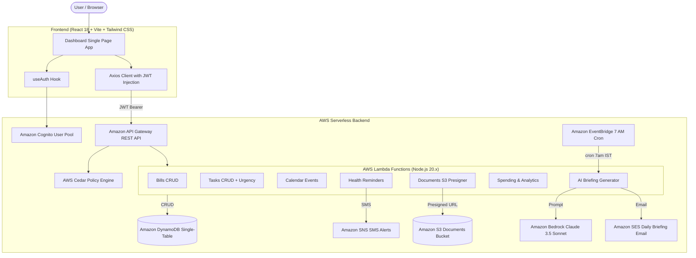

# Life Dashboard

> **A personal life management dashboard that replaces 10 different apps with one intelligent page.**  
> Every morning, an AI reads all the user's data and delivers a prioritized, plain-English briefing: what needs attention today, what can wait, and what they might be forgetting.

---

## Architecture Overview



---

## Core Modules

1. **AI Morning Briefing**:
   - Automated EventBridge trigger (`cron(0 1 * * ? *)`, 7:00 AM IST) reads all domains and synthesizes an executive summary via Amazon Bedrock (Anthropic Claude 3.5 Sonnet).
   - Character-by-character live typewriter streaming via `ReadableStream`.
   - Dispatches daily email briefings via Amazon SES.
2. **Bills & Payments**:
   - Tracks amounts, recurring frequencies (`monthly`, `weekly`, `yearly`), and due dates.
   - Dynamic status visualizer: Red (overdue), Orange (due within 3 days), Grey (upcoming), Green (paid).
   - Running total of unpaid and overdue balances.
3. **Tasks & Urgency Engine**:
   - Tracks deadlines and priorities (`high`, `medium`, `low`).
   - Bedrock daily urgency re-ranking badge (`AI #1` to `AI #10`).
   - Native HTML5 Drag-and-Drop handles for manual priority overrides.
   - Smooth strike-through completion animation.
4. **Calendar**:
   - 7-day rolling horizon highlighting today's schedule and upcoming appointments.
   - Time badges, location indicators, and meeting notes.
5. **Health Reminders**:
   - Tracks daily and weekly wellness habits (vitamins, hydration, stretching).
   - Integrated with Amazon SNS for transactional SMS alert dispatch.
6. **Documents Vault**:
   - Uploads files directly to private Amazon S3 storage using secure presigned `PUT` URLs.
   - 30-day early expiration warning indicators with amber and red alert badges.
   - Presigned `GET` URLs for direct, private viewing and downloading.
7. **Spending & Analytics**:
   - Donut Chart breakdown by category (`food`, `transport`, `bills`, `health`, `entertainment`, `other`) powered by Recharts.
   - Monthly history switcher and running total progress against a soft monthly budget.
   - Month-over-month variance analysis (`% vs last mo`).

---

## Database Schema (DynamoDB Single-Table Design)

- **Table Name**: `LifeDashboard`
- **Billing Mode**: `PAY_PER_REQUEST`
- **Partition Key (PK)**: `USER#{userId}`
- **Sort Key (SK)**: `{ENTITY}#{id}`

| Entity | SK Pattern | Key Attributes |
|---|---|---|
| **Bills** | `BILL#{id}` | `name`, `amount`, `dueDate`, `isPaid`, `isRecurring`, `frequency` |
| **Tasks** | `TASK#{id}` | `title`, `description`, `dueDate`, `priority`, `isCompleted`, `aiRank` |
| **Calendar** | `EVENT#{id}` | `title`, `date`, `time`, `location`, `notes` |
| **Health** | `HEALTH#{id}` | `name`, `frequency`, `time`, `phoneNumber`, `lastTriggered` |
| **Documents** | `DOC#{id}` | `name`, `s3Key`, `fileType`, `category`, `expiryDate` |
| **Spending** | `SPEND#{id}` | `amount`, `category`, `description`, `date` |
| **Briefing** | `BRIEFING#{date}` | `date`, `content`, `generatedAt` |

---

## Authorization (AWS Cedar Policies)

Defined in [`cedar/policies.cedar`](file:///Users/akshatmohanty/aws%20hackathon/life-dashboard/cedar/policies.cedar):
1. **Tenant Isolation**: Users are strictly permitted to `GetItem`, `PutItem`, `UpdateItem`, and `DeleteItem` only on records where `resource.userId == principal.userId`.
2. **S3 Boundaries**: Restricts object reads, writes, and deletes to `resource.ownerId == principal.userId`.
3. **EventBridge Service Role**: Permits `Role::"EventBridgeBriefingLambdaRole"` global read access across users for synthesis, but restricts write operations solely to `resource.entityType == "Briefing"`.

---

## Local Development & Testing

### 1. Prerequisites
- Node.js 20+
- Docker (optional, for LocalStack)
- AWS SAM CLI (optional, for cloud deployment)

### 2. Fast Local Development (Zero Docker Required)
Start the local API Gateway and Vite frontend concurrently:

```bash
# Terminal 1: Start backend API Gateway simulator (Port 3001)
cd backend
npm run local-server

# Terminal 2: Start Vite frontend (Port 5173)
cd frontend
npm run dev
```

Visit `http://localhost:5173` and click **"Continue as Demo User (Instant)"** to immediately access the dashboard with realistic seed data.

### 3. LocalStack Development (Docker)
```bash
# Start LocalStack
make local-up

# Provision local DynamoDB table, S3 bucket, and seed mock data
make local-init
make seed

# Run SAM Local API
make local-api
```

### 4. Running Test Suites
```bash
# Backend Integration Test Suite (24 tests)
npm --prefix backend test

# End-to-End Synthetic User Lifecycle Test (16 assertions across all 7 modules)
node backend/scripts/e2e-synthetic-test.js
```

---

## Cloud Deployment

### Backend (AWS SAM)
```bash
# Automated deployment script
./backend/scripts/deploy-backend.sh

# Or manual SAM build & deploy
cd backend
sam build
sam deploy
```

### Frontend (AWS Amplify Hosting)
```bash
# Automated Amplify packaging and deployment
./frontend/scripts/deploy-amplify.sh
```

### Production Services Activation
```bash
# Configure EventBridge 7 AM IST trigger, SES sender identity, and SNS SMS attributes
./backend/scripts/configure-production-services.sh your-email@domain.com
```
